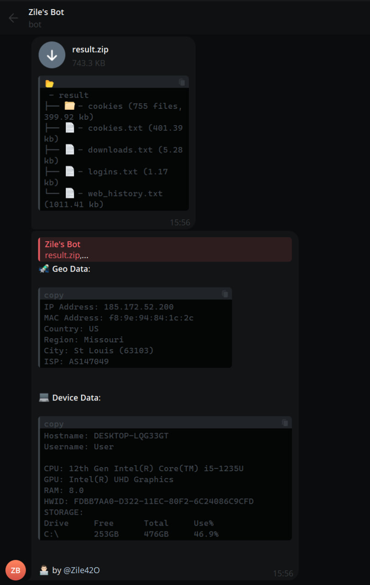

# browser-stealer
Telegram based browser stealer data in Python

## Demo/Example

## Run/Install/Compile

`pip install -r requirements.txt`

`python ./stealer.py`

`pip install pyinstaller`

`pyinstaller --onefile stealer.py`
- Exe should be in dist/

## Credits
addi00000

## Disclaimer
This repository is for academic purposes, the use of this software is your responsibility.
